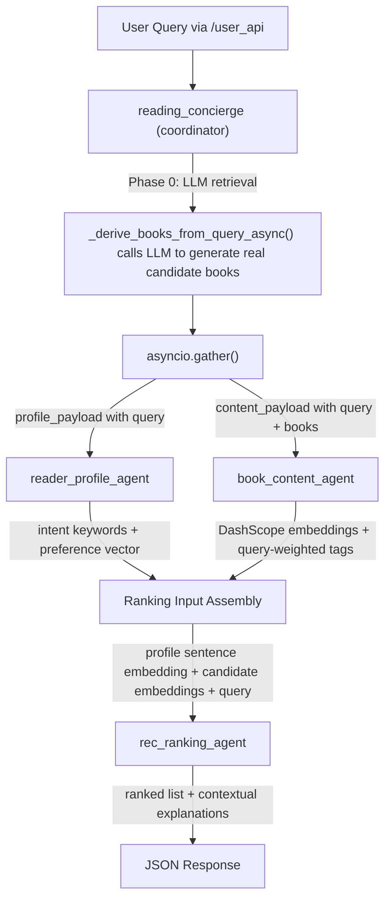

# ACPs Reading Recsys — Debug Plan

## Overview

Systematically fix all 12 defects identified in PassedWorkBug.md across 6 phases, transforming the system from returning hardcoded stubs into a functional ACPs multi-agent book recommender that retrieves real books via LLM, encodes them in a shared semantic space, and produces query-aware ranked results with contextual explanations.

## To-Do Checklist

- [x] Phase 1a: Fix `call_openai_chat()` to use async OpenAI client in `base.py` *(already implemented — code uses `AsyncOpenAI` + `await`)*
- [x] Phase 1b: Create `.gitignore` and `.env.example`, secure API key
- [x] Phase 1c: Add LRU session eviction in `reading_concierge.py`
- [x] Phase 2-pre: Build minimal real-book dataset pipeline (ingest → preprocess → retrieval index)
- [x] Phase 2a: Rewrite `_derive_books_from_query()` with LLM retrieval, update all call sites to async
- [x] Phase 2b: Fix cold-start seeding to use dataset/LLM-derived books (no hardcoded stubs)
- [x] Phase 3a: Pass query to `profile_payload` and update `_generate_intent_keywords()` prompt
- [x] Phase 3b: Pass query to `content_payload` and add query-weighted tag boosting
- [x] Phase 4a-b: Add DashScope embedding backend in `model_backends.py`, update `.env` config
- [x] Phase 4c-d: Fix profile-content vector alignment with shared embedding space, update book content agent
- [x] Phase 5a: Fix `_tokenize_text()` for Unicode/Chinese support
- [x] Phase 5b: Enrich explanation prompt with query, description, genres, profile summary
- [x] Phase 5c: Add min-pool-size guard to `_normalize_score_rows()`
- [x] Phase 6a: Improve baseline rankers with LLM candidate retrieval
- [x] Phase 6b: Update all tests for async changes and new behaviors

## Target Architecture After Fix



## Key Design Decisions

- **Embedding strategy**: Use DashScope's `text-embedding-v3` model via the OpenAI-compatible API endpoint (already configured in `.env`). No local model download required. The `model_backends.py` module will gain a new DashScope-embedding path alongside the existing SentenceTransformer and hash-fallback paths.
- **Profile-content vector alignment**: Both the user profile summary and book content will be encoded as natural-language sentences through the same DashScope embedding model, ensuring a shared semantic space.
- **Chinese support**: Use `re.findall(r"[\w]+", text, re.UNICODE)` as a minimal fix; full `jieba` integration is out of scope for this debug round but noted for future work.

---

## Phase 1 — Foundation Fixes (D9, D12, D8)

Fix infrastructure-level defects that affect all subsequent work.

### 1a. Fix `call_openai_chat()` to be truly async (D9)

**File:** `base.py`

Replace the sync `openai.chat.completions.create()` with the async client:

```python
_async_client = None

def _get_async_client():
    global _async_client
    if _async_client is None:
        _async_client = openai.AsyncOpenAI(
            api_key=os.getenv("OPENAI_API_KEY"),
            base_url=os.getenv("OPENAI_BASE_URL"),
        )
    return _async_client
```

Then in `call_openai_chat()`, use `await _get_async_client().chat.completions.create(**kwargs)`.

### 1b. Secure `.env` (D12)

- Create a root-level `.gitignore` that includes `.env`, `__pycache__/`, `venv/`, `*.pyc`.
- Create `.env.example` with placeholder values.

### 1c. Add session eviction (D8)

**File:** `reading_concierge/reading_concierge.py`

Replace the bare `sessions` dict with an `OrderedDict`-based LRU cache capped at 200 entries. Evict oldest on insert when full.

---

## Phase 2 — LLM-Backed Book Retrieval (D1, D10)

The critical fix: make the system retrieve real books.

### 2-pre. Real data prerequisite (PLAN.md alignment)

**Why this must happen first:** `PLAN.md` defines book dataset acquisition and preprocessing as core prerequisites. Without real books, Phase 2a still evaluates on synthetic stubs and cannot validate recommendation quality.

**Minimal deliverable for this phase gate:**

- Add a small open real-book sample dataset under `data/raw/` (e.g., public Book-Crossing/Open Library derived sample with clear provenance).
- Implement a deterministic preprocessing script that outputs normalized records into `data/processed/`.
- Build a lightweight lexical retrieval index from processed records for fallback candidate generation.
- Document required fields (`book_id`, `title`, `author`, `description`, `genres`) and data quality checks.

**Acceptance criteria:**

- `data/processed/books_min.jsonl` exists with non-empty normalized records.
- Retrieval module can return non-empty candidates for at least 3 domain queries in local tests.
- `_derive_books_from_query()` no longer depends exclusively on hardcoded stubs for candidate discovery.

### 2a. Rewrite `_derive_books_from_query()` (D1)

**File:** `reading_concierge/reading_concierge.py`, lines 414-442

Convert to `async def _derive_books_from_query(query, candidate_ids)` that calls `call_openai_chat` with a structured prompt asking the LLM to select best `book_id`s from real dataset candidates. Use lexical retrieval over the prepared real dataset as fallback if LLM output is invalid. Do not use hardcoded stub books.

Update all call sites to `await`:

- Line 457: `_seed_cold_start_history()` must become `async`
- Line 585: in `_orchestrate_reading_flow()`
- Line 493: the cold-start seed path in `_scenario_policy()` needs restructuring (move seed logic into the orchestration function so `await` is available)

### 2b. Fix cold-start seeding (D10)

**File:** `reading_concierge/reading_concierge.py`, lines 456-493

Once `_derive_books_from_query()` returns real dataset/LLM-derived books, cold-start benefits automatically. For cold-start scenarios, seed history from derived real-book genres and metadata instead of any hardcoded genre defaults.

---

## Phase 3 — Query Propagation (D2, D5)

Thread the user query through the entire pipeline.

### 3a. Pass query to profile agent (D2)

**File:** `reading_concierge/reading_concierge.py`, lines 579-584

Add `"query": req.query` to `profile_payload`.

**File:** `agents/reader_profile_agent/profile_agent.py`, lines 298-322

In `_generate_intent_keywords()`, prepend the query to the LLM prompt:

```python
query = payload.get("query") or ""
prompt = (
    "You are an assistant that extracts latent reading intents and topical keywords.\n"
    f"Current user query: {query}\n"
    f"History samples:\n{...}\n"
    f"Recent reviews:\n{...}"
)
```

### 3b. Pass query to content agent (D5)

**File:** `reading_concierge/reading_concierge.py`, lines 586-592

Add `"query": req.query` to `content_payload`.

**File:** `agents/book_content_agent/book_content_agent.py`, lines 132-182

In `_heuristic_tags_for_book()`, accept an optional `query` parameter. Tokenize the query and boost `topic_counts` for any topic token that overlaps with query tokens. Thread the query from `_analyze_content()` down into tag generation.

---

## Phase 4 — Embedding Pipeline Fix (D3, Root Cause C)

Replace meaningless hash vectors with real semantic embeddings in a shared space.

### 4a. Add DashScope embedding backend

**File:** `services/model_backends.py`

Add a new function `_resolve_dashscope_embeddings(texts, model_name)` that calls the DashScope embedding API via the OpenAI-compatible endpoint:

```python
async def generate_text_embeddings_async(texts, model_name, fallback_dim=12):
    # 1. Try DashScope embedding API (text-embedding-v3)
    # 2. Fall back to SentenceTransformer if available
    # 3. Fall back to hash embedding as last resort
```

The DashScope embedding call uses the same `OPENAI_BASE_URL` and `OPENAI_API_KEY` already in `.env`, with model `"text-embedding-v3"`.

### 4b. Add embedding config to `.env`

Add to `.env`:

```
BOOK_CONTENT_EMBED_MODEL=text-embedding-v3
```

### 4c. Fix profile-content vector alignment (Root Cause C)

**File:** `agents/rec_ranking_agent/rec_ranking_agent.py`, lines 157-167

Replace `_flatten_profile_to_vector()` with a function that converts the profile dict into a natural-language sentence and encodes it with the same embedding model:

```python
async def _profile_to_embedding(profile_vector: dict, query: str) -> List[float]:
    summary = _profile_to_sentence(profile_vector, query)
    embeddings, _ = await generate_text_embeddings_async([summary], model_name=EMBED_MODEL)
    return embeddings[0] if embeddings else []
```

Where `_profile_to_sentence()` produces something like: `"A reader interested in science fiction who enjoys fast pacing, intermediate difficulty, themes of ecology and politics. Current query: recommend books about space exploration"`.

This ensures user vectors and book vectors share the same semantic space.

### 4d. Update book content agent to use async embeddings

**File:** `agents/book_content_agent/book_content_agent.py`, lines 212-240

Update `_vectorize_books()` to call `generate_text_embeddings_async()` instead of the sync version.

---

## Phase 5 — Ranking Quality Fixes (D4, D6, D7)

### 5a. Fix `_tokenize_text()` for Unicode (D4)

**File:** `agents/rec_ranking_agent/rec_ranking_agent.py`, lines 131-133

```python
def _tokenize_text(value: Any) -> List[str]:
    text = str(value or "").lower()
    return [tok for tok in re.findall(r"[\w]+", text, re.UNICODE) if len(tok) >= 2]
```

### 5b. Enrich explanation prompt (D6)

**File:** `agents/rec_ranking_agent/rec_ranking_agent.py`, lines 348-401

Pass `query`, `description`, `genres`, and a profile summary into the explanation prompt. The `raw_candidate` field (already stored in the ranking row at line 288) provides the book metadata. Add the query from the payload.

New prompt structure:

```
User query: {query}
User preference: {profile_summary}
Book: {title} by {author}
Description: {description}
Genres: {genres}
Scores: {score_parts}
Generate a concise recommendation explanation.
```

### 5c. Fix min-max normalization for small pools (D7)

**File:** `agents/rec_ranking_agent/rec_ranking_agent.py`, lines 206-219

Add a minimum pool-size guard: only apply min-max normalization when the pool has 3+ candidates. For smaller pools, use the raw scores (already bounded to [0, 1]).

---

## Phase 6 — Baseline & Regression (D11)

### 6a. Improve baseline rankers

**File:** `services/baseline_rankers.py`

Enhance `traditional_hybrid_rank()` to also call the LLM for candidate retrieval (same as the ACPs pipeline) so it operates on the same real book pool. The ranking formula remains heuristic (no trained model), which is a fair representation of a non-agent hybrid baseline.

### 6b. Update tests

Update existing tests across all test files to account for:

- `_derive_books_from_query()` now being async
- `call_openai_chat()` using the async client
- New `query` fields in payloads
- New embedding function signatures

The test `conftest.py` mock needs updating to handle the async OpenAI client pattern.

---

## File Change Summary

| File | Changes |
|---|---|
| `base.py` | Async OpenAI client (D9) |
| `.gitignore` (new) | Ignore `.env` and cache dirs (D12) |
| `.env.example` (new) | Placeholder config template (D12) |
| `.env` | Add `BOOK_CONTENT_EMBED_MODEL=text-embedding-v3` |
| `reading_concierge/reading_concierge.py` | LLM book retrieval (D1), query in payloads (D2, D5), session LRU (D8), cold-start fix (D10) |
| `agents/reader_profile_agent/profile_agent.py` | Query-aware intent extraction (D2) |
| `agents/book_content_agent/book_content_agent.py` | Query-weighted tags (D5), async embeddings (D3) |
| `agents/rec_ranking_agent/rec_ranking_agent.py` | Unicode tokenizer (D4), explanation enrichment (D6), normalization guard (D7), profile-to-embedding (Root Cause C) |
| `services/model_backends.py` | DashScope embedding backend (D3), async API |
| `services/baseline_rankers.py` | LLM-based candidate retrieval for baselines (D11) |
| `tests/conftest.py` | Update mocks for async client |
| `tests/test_*.py` | Update assertions for new behaviors |
