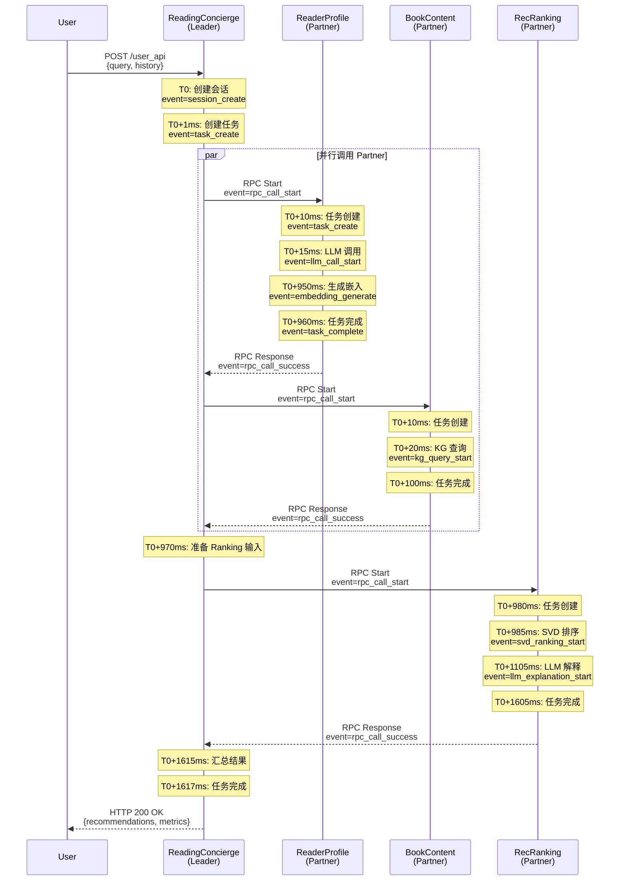
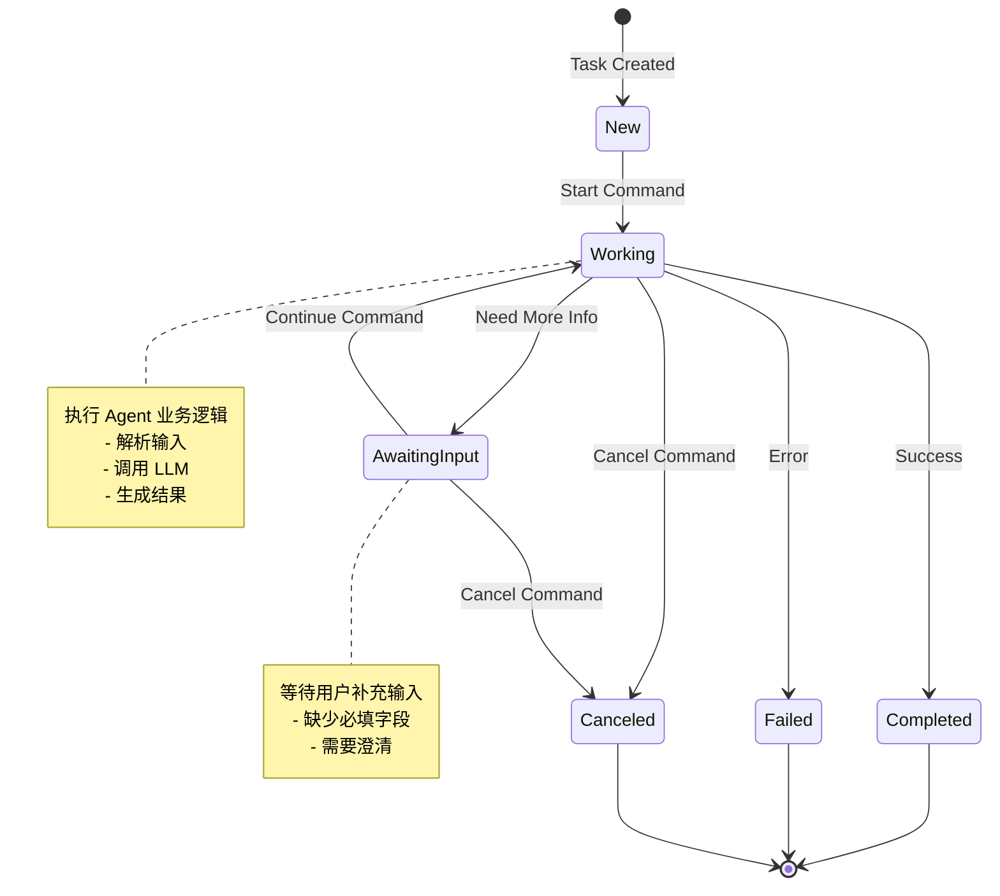
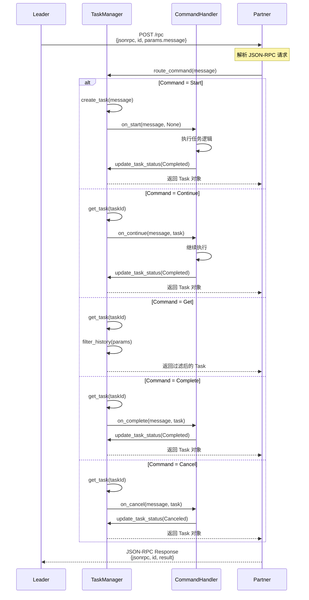

# ACPS 事件驱动架构详解

**版本**: v3.0  
**最后更新**: 2026-03-11  
**维护者**: Code7 (Coordinator)  
**协议版本**: AIP v1.0

---

## 📋 目录

1. [系统概览](#系统概览)
2. [事件驱动架构](#事件驱动架构)
3. [完整事件流](#完整事件流)
4. [ACS 协议深度解析](#acs 协议深度解析)
5. [新增 Agent 集成指南](#新增 agent 集成指南)
6. [协议配置完整规则](#协议配置完整规则)
7. [通信流程图](#通信流程图)

---

## 系统概览

### 运行时架构

```
┌─────────────────────────────────────────────────────────────┐
│                         User Layer                           │
│  ┌─────────────┐  ┌──────────────┐  ┌─────────────────────┐ │
│  │  Web Demo   │  │  Mobile App  │  │  Third-party Client │ │
│  │  Port: 8100 │  │   (Future)   │  │      (Future)       │ │
│  └──────┬──────┘  └──────┬───────┘  └──────────┬──────────┘ │
└─────────┼────────────────┼──────────────────────┼────────────┘
          │                │                      │
          │ HTTP/REST API  │                      │
          ▼                ▼                      ▼
┌─────────────────────────────────────────────────────────────┐
│                    Leader Agent Layer                        │
│  ┌────────────────────────────────────────────────────────┐ │
│  │           ReadingConcierge (reading_concierge)         │ │
│  │  Port: 8100 (User API) + 8100 (Leader RPC)             │ │
│  │  ┌──────────────────────────────────────────────────┐  │ │
│  │  │  Event Loop (asyncio)                            │  │ │
│  │  │  - Session Management                            │  │ │
│  │  │  - Task Coordination                             │  │ │
│  │  │  - Parallel Partner Calls                        │  │ │
│  │  └──────────────────────────────────────────────────┘  │ │
│  └────────────────────────────────────────────────────────┘ │
└────────────────────────┬────────────────────────────────────┘
                         │
                         │ AIP over JSON-RPC 2.0
                         │
         ┌───────────────┼───────────────┬───────────────┐
         │               │               │               │
         ▼               ▼               ▼               ▼
┌─────────────┐ ┌──────────────┐ ┌──────────────┐ ┌───────────┐
│Partner 1    │ │ Partner 2    │ │ Partner 3    │ │ Partner N │
│ReaderProfile│ │ BookContent  │ │ RecRanking   │ │ (Future)  │
│Port: 8211   │ │ Port: 8212   │ │ Port: 8213   │ │           │
├─────────────┤ ├──────────────┤ ├──────────────┤ ├───────────┤
│Skills:      │ │Skills:       │ │Skills:       │ │           │
│- profile.   │ │- book.       │ │- ranking.    │ │           │
│  extract    │ │  vectorize   │ │  svd         │ │           │
│- preference.│ │- kg.         │ │- ranking.    │ │           │
│  embedding  │ │  enrich      │ │  multifactor │ │           │
│- sentiment. │ │- tag.        │ │- explanation.│ │           │
│  analysis   │ │  extract     │ │  llm         │ │           │
└─────────────┘ └──────────────┘ └──────────────┘ └───────────┘
```

### 核心组件

| 组件 | 位置 | 职责 |
|------|------|------|
| **Leader** | `reading_concierge/` | 编排协调、会话管理、任务分发 |
| **TaskManager** | `acps_aip/aip_rpc_server.py` | 任务创建、状态管理、产品生成 |
| **CommandHandlers** | `acps_aip/aip_rpc_server.py` | 命令处理（Start/Continue/Get/Complete/Cancel） |
| **AipRpcClient** | `acps_aip/aip_rpc_client.py` | RPC 客户端（Leader → Partner） |
| **Partner Agent** | `agents/*/` | 专业服务提供者 |

---

## 事件驱动架构

### Event 类型汇总

系统在运行过程中会产生以下事件：

#### 1. 任务生命周期事件

| Event | 触发时机 | 说明 | 示例日志 |
|-------|----------|------|----------|
| `task_create` | Leader 创建新任务 | 启动新任务 | `event=task_create task_id=task-123 command=Start` |
| `task_state_change` | 任务状态变更 | Working → Completed 等 | `event=task_state_change task_id=task-123 from=Working to=Completed` |
| `task_complete` | 任务完成 | 生成最终产品 | `event=task_complete task_id=task-123 products=1` |
| `task_fail` | 任务失败 | 异常处理 | `event=task_fail task_id=task-123 error=analysis failed` |
| `task_cancel` | 任务取消 | 用户主动取消 | `event=task_cancel task_id=task-123` |

#### 2. RPC 通信事件

| Event | 触发时机 | 说明 | 示例日志 |
|-------|----------|------|----------|
| `rpc_call_start` | Leader 发起 RPC 调用 | 开始调用 Partner | `event=rpc_call_start partner=reader_profile task_id=task-123` |
| `rpc_call_success` | RPC 调用成功 | 收到 Partner 响应 | `event=rpc_call_success partner=reader_profile latency_ms=150` |
| `rpc_call_failed` | RPC 调用失败 | 连接错误、超时等 | `event=rpc_call_failed partner=reader_profile error=Connection refused` |
| `rpc_timeout` | RPC 超时 | 超过设定时间 | `event=rpc_timeout partner=reader_profile timeout_ms=30000` |

#### 3. Agent 内部事件

| Event | 触发时机 | 说明 | 示例日志 |
|-------|----------|------|----------|
| `payload_parse_failed` | 解析输入失败 | JSON 格式错误 | `event=payload_parse_failed task_id=task-123` |
| `awaiting_input` | 等待用户输入 | 缺少必填字段 | `event=awaiting_input task_id=task-123 missing=user_profile` |
| `profile_analysis_failed` | 画像分析失败 | ReaderProfile 异常 | `event=profile_analysis_failed task_id=task-123` |
| `book_content_continue_failed` | 内容分析失败 | BookContent 异常 | `event=book_content_continue_failed task_id=task-123` |
| `ranking_failed` | 排序决策失败 | RecRanking 异常 | `event=ranking_failed task_id=task-123` |

#### 4. 模型调用事件

| Event | 触发时机 | 说明 | 示例日志 |
|-------|----------|------|----------|
| `llm_call_start` | 调用 LLM | 开始 API 调用 | `event=llm_call_start model=qwen3.5-plus task_id=task-123` |
| `llm_call_success` | LLM 调用成功 | 收到响应 | `event=llm_call_success model=qwen3.5-plus latency_ms=800` |
| `llm_call_failed` | LLM 调用失败 | API 错误 | `event=llm_call_failed model=qwen3.5-plus error=Rate limit` |
| `embedding_generate` | 生成嵌入向量 | 调用嵌入模型 | `event=embedding_generate model=qwen3-vl-embedding dim=1024` |
| `dashscope_failed` | DashScope 失败 | 降级到 fallback | `event=dashscope_failed fallback=hash-fallback` |

#### 5. 会话管理事件

| Event | 触发时机 | 说明 | 示例日志 |
|-------|----------|------|----------|
| `session_create` | 创建新会话 | 新用户请求 | `event=session_create session_id=session-123` |
| `session_evict` | 会话被驱逐 | LRU 缓存满 | `event=session_evict session_id=session-old created_at=2026-03-11T10:00:00Z` |
| `session_message_add` | 添加消息到会话 | 用户输入或 Agent 响应 | `event=session_message_add session_id=session-123 message_count=5` |

---

### 完整事件流：用户推荐请求

#### 阶段 1: 用户请求 → Leader

```
时间轴：T0
用户 → ReadingConcierge (HTTP POST)
POST http://localhost:8100/user_api
{
  "session_id": "session-123",
  "query": "推荐一些科幻小说",
  "history": [...]
}

↓

[ReadingConcierge 内部处理]
T0+1ms: event=session_create session_id=session-123
T0+2ms: event=task_create task_id=task-concierge-001 command=Start
T0+3ms: event=task_state_change task_id=task-concierge-001 from=New to=Working
```

#### 阶段 2: Leader → Partner（并行调用）

```
时间轴：T0+5ms

[ReadingConcierge 内部处理]
T0+5ms: event=rpc_call_start partner=reader_profile task_id=task-profile-001
T0+5ms: event=rpc_call_start partner=book_content task_id=task-content-001

↓

[ReaderProfile 处理]
T0+10ms: event=task_create task_id=task-profile-001 command=Start
T0+11ms: event=task_state_change task_id=task-profile-001 from=New to=Working
T0+12ms: event=payload_parse_success task_id=task-profile-001
T0+15ms: event=llm_call_start model=qwen3.5-plus task_id=task-profile-001
T0+950ms: event=llm_call_success model=qwen3.5-plus latency_ms=935
T0+955ms: event=embedding_generate model=qwen3-vl-embedding dim=1024
T0+960ms: event=task_complete task_id=task-profile-001 products=1

↓

[BookContent 处理]
T0+10ms: event=task_create task_id=task-content-001 command=Start
T0+11ms: event=task_state_change task_id=task-content-001 from=New to=Working
T0+20ms: event=kg_query_start query=books_by_genre
T0+100ms: event=kg_query_success results=30
T0+105ms: event=task_complete task_id=task-content-001 products=1

↓

[ReadingConcierge 接收响应]
T0+965ms: event=rpc_call_success partner=reader_profile latency_ms=960
T0+110ms: event=rpc_call_success partner=book_content latency_ms=105
```

#### 阶段 3: Leader → RecRanking

```
时间轴：T0+970ms

[ReadingConcierge 内部处理]
T0+970ms: event=ranking_input_prepare profile_vector_size=7 candidates_count=30
T0+971ms: event=rpc_call_start partner=rec_ranking task_id=task-ranking-001

↓

[RecRanking 处理]
T0+980ms: event=task_create task_id=task-ranking-001 command=Start
T0+981ms: event=task_state_change task_id=task-ranking-001 from=New to=Working
T0+985ms: event=svd_ranking_start candidates=30 n_components=8
T0+1100ms: event=svd_ranking_complete latency_ms=115
T0+1105ms: event=llm_explanation_start books=5
T0+1600ms: event=llm_explanation_complete latency_ms=495
T0+1605ms: event=task_complete task_id=task-ranking-001 products=1

↓

[ReadingConcierge 接收响应]
T0+1610ms: event=rpc_call_success partner=rec_ranking latency_ms=639
```

#### 阶段 4: Leader → User

```
时间轴：T0+1615ms

[ReadingConcierge 内部处理]
T0+1615ms: event=ranking_result_aggregate items=5 avg_score=0.85
T0+1616ms: event=task_complete task_id=task-concierge-001 products=1
T0+1617ms: event=session_message_add session_id=session-123 message_count=2

↓

[响应给用户]
T0+1620ms: HTTP 200 OK
{
  "session_id": "session-123",
  "recommendations": [
    {"book_id": "1", "title": "三体", "score": 0.95, "explanation": "..."},
    {"book_id": "2", "title": "流浪地球", "score": 0.88, "explanation": "..."},
    ...
  ],
  "metrics": {
    "avg_novelty": 0.45,
    "avg_diversity": 0.72,
    "latency_ms": 1620
  }
}
```

---

## ACS 协议深度解析

### 什么是 ACS？

**ACS** (Agent Collaboration System) 是基于 AIP 协议的**配置和描述系统**，用于：

1. **描述 Agent 能力** - Skills、Endpoints、Capabilities
2. **配置通信参数** - mTLS、RPC 端点、环境变量
3. **定义安全策略** - 认证方式、授权规则

### ACS 配置文件结构

#### ReadingConcierge (Leader) 配置

**文件**: `reading_concierge/reading_concierge.json`

```json
{
  "acs": {
    "aic": "reading_concierge_001",              // Agent ID (Agent Interoperability Coordinator)
    "protocolVersion": "01.00",                   // AIP 协议版本
    "name": "Reading Concierge Coordinator",      // Agent 名称
    "description": "Leader coordinator for ACPs-based personalized reading recommendation orchestration.",
    "version": "1.0.0",                           // Agent 版本
    
    // 提供者信息
    "provider": {
      "organization": "BUPT",
      "department": "AI School"
    },
    
    // 安全配置
    "securitySchemes": {
      "mtls": {
        "type": "mutualTLS",                      // 双向 SSL 认证
        "description": "mTLS for ACPs inter-agent communication"
      }
    },
    
    // 端点配置
    "endPoints": [
      {
        "transport": "JSONRPC",                   // 传输协议
        "url": "http://0.0.0.0:8100/user_api",    // 端点 URL
        "description": "Primary orchestration endpoint (remote access enabled)"
      }
    ],
    
    // 能力声明
    "capabilities": {
      "streaming": false,                         // 是否支持流式响应
      "notification": false,                      // 是否支持通知
      "messageQueue": []                          // 消息队列支持
    },
    
    // 技能列表
    "skills": [
      {
        "id": "reading.orchestrate",
        "name": "reading.orchestrate",
        "description": "Orchestrate profile/content/ranking agents into unified recommendation flow"
      }
    ],
    
    // 活跃状态
    "active": true                                // 是否活跃（可被调用）
  }
}
```

#### ReaderProfile (Partner) 配置

**文件**: `agents/reader_profile_agent/config.example.json`

```json
{
  // mTLS 证书配置
  "mtls": {
    "cert_path": "certs/reader_profile.crt",      // 客户端证书
    "key_path": "certs/reader_profile.key",       // 私钥
    "ca_path": "certs/ca.crt"                     // CA 根证书
  },
  
  // ACS 协议配置
  "acs": {
    "aic": "reader_profile_agent_001",            // Agent ID
    "skills": [                                    // 技能列表
      "profile.extract",                          // 偏好提取
      "preference.embedding",                     // 偏好嵌入
      "sentiment.analysis"                        // 情感分析
    ],
    "endpoint": "https://localhost:8211/reader-profile/rpc"  // RPC 端点
  },
  
  // 环境变量配置
  "environment": {
    "READER_PROFILE_AGENT_ENDPOINT": "/reader-profile/rpc",
    "READER_PROFILE_DEFAULT_SCENARIO": "warm",
    "READER_PROFILE_DEFAULT_GENRES": "fiction:0.25,science_fiction:0.2,history:0.15"
  }
}
```

### ACS 字段详解

#### 核心字段

| 字段 | 类型 | 必填 | 说明 | 示例 |
|------|------|------|------|------|
| `aic` | string | ✅ | Agent 唯一标识符 | `reading_concierge_001` |
| `protocolVersion` | string | ✅ | AIP 协议版本 | `01.00` |
| `name` | string | ✅ | Agent 名称 | `Reading Concierge` |
| `description` | string | ✅ | Agent 描述 | `Leader coordinator...` |
| `version` | string | ✅ | Agent 版本 | `1.0.0` |
| `active` | boolean | ✅ | 是否活跃 | `true` |

#### 安全配置

```json
"securitySchemes": {
  "mtls": {
    "type": "mutualTLS",
    "description": "mTLS for ACPs inter-agent communication"
  }
}
```

**支持的类型**:
- `mutualTLS` - 双向 SSL 认证
- `apiKey` - API Key 认证（未来扩展）
- `oauth2` - OAuth2 认证（未来扩展）

#### 端点配置

```json
"endPoints": [
  {
    "transport": "JSONRPC",
    "url": "http://0.0.0.0:8100/user_api",
    "description": "Primary orchestration endpoint"
  }
]
```

**支持的传输协议**:
- `JSONRPC` - JSON-RPC 2.0
- `HTTP` - HTTP/REST（未来扩展）
- `gRPC` - gRPC（未来扩展）

#### 技能配置

```json
"skills": [
  {
    "id": "reading.orchestrate",
    "name": "reading.orchestrate",
    "description": "Orchestrate profile/content/ranking agents"
  }
]
```

**技能命名规范**:
- 格式：`<domain>.<action>`
- 示例：`profile.extract`, `book.vectorize`, `ranking.svd`

---

## 新增 Agent 集成指南

### 场景：添加新的 Partner Agent

假设我们要添加一个 **"阅读难度分析 Agent"** (`ReadingDifficultyAgent`)

### 步骤 1: 创建 Agent 基础结构

```
agents/
└── reading_difficulty_agent/
    ├── __init__.py
    ├── reading_difficulty_agent.py    # Agent 主逻辑
    ├── config.example.json            # ACS 配置模板
    └── reading_difficulty.json        # ACS 描述文件
```

### 步骤 2: 实现 Agent 主逻辑

**文件**: `agents/reading_difficulty_agent/reading_difficulty_agent.py`

```python
from fastapi import FastAPI
from pathlib import Path
from base import get_agent_logger, register_acs_route
from acps_aip.aip_rpc_server import add_aip_rpc_router, TaskManager, CommandHandlers
from acps_aip.aip_base_model import Message, Task, TaskState, Product, TextDataItem, StructuredDataItem
import os

# 加载环境变量
from dotenv import load_dotenv
load_dotenv()

# Agent 配置
AGENT_ID = os.getenv("READING_DIFFICULTY_AGENT_ID", "reading_difficulty_agent_001")
AIP_ENDPOINT = os.getenv("READING_DIFFICULTY_AGENT_ENDPOINT", "/reading-difficulty/rpc")
LOG_LEVEL = os.getenv("READING_DIFFICULTY_LOG_LEVEL", "INFO").upper()

logger = get_agent_logger("agent.reading_difficulty", "READING_DIFFICULTY_LOG_LEVEL", LOG_LEVEL)

# 创建 FastAPI 应用
app = FastAPI(
    title="Reading Difficulty Agent",
    description="Analyzes reading difficulty level of books"
)

# 注册 ACS 路由
_ACS_JSON_PATH = str(Path(__file__).parent / "reading_difficulty.json")
register_acs_route(app, _ACS_JSON_PATH)

# 任务上下文
_DIFFICULTY_CONTEXT: dict[str, dict] = {}

# 命令处理器
async def handle_start(message: Message, existing_task: Task | None) -> Task:
    if existing_task:
        return existing_task
    
    task = TaskManager.create_task(message, initial_state=TaskState.Working)
    logger.info(f"event=task_create task_id={task.id} command=Start")
    
    try:
        # 解析输入
        payload = _parse_payload(message)
        
        # 验证必填字段
        missing = _validate_payload(payload)
        if missing:
            logger.info(f"event=awaiting_input task_id={task.id} missing={missing}")
            return _set_awaiting_input(task.id, missing)
        
        # 执行难度分析
        result = await _analyze_difficulty(payload)
        
        # 完成任务
        return _finalize_task(task.id, result)
        
    except Exception as exc:
        logger.exception(f"event=difficulty_analysis_failed task_id={task.id}")
        return _fail_task(task.id, f"analysis failed: {exc}")

async def handle_continue(message: Message, task: Task) -> Task:
    TaskManager.add_message_to_history(task.id, message)
    logger.info(f"event=task_continue task_id={task.id}")
    # ... 实现 Continue 逻辑

def _cancel_handler(message: Message, task: Task) -> Task:
    _DIFFICULTY_CONTEXT.pop(task.id, None)
    logger.info(f"event=task_cancel task_id={task.id}")
    return TaskManager.update_task_status(task.id, TaskState.Canceled)

# 注册命令处理器
agent_handlers = CommandHandlers(
    on_start=handle_start,
    on_continue=handle_continue,
    on_cancel=_cancel_handler,
)

add_aip_rpc_router(app, AIP_ENDPOINT, agent_handlers)

# 辅助函数
def _parse_payload(message: Message) -> dict:
    # ... 实现解析逻辑
    pass

def _validate_payload(payload: dict) -> list[str]:
    # ... 实现验证逻辑
    pass

async def _analyze_difficulty(payload: dict) -> dict:
    # ... 实现难度分析逻辑
    pass

def _finalize_task(task_id: str, result: dict) -> Task:
    # ... 实现任务完成逻辑
    pass

def _set_awaiting_input(task_id: str, missing: list[str]) -> Task:
    # ... 实现等待输入逻辑
    pass

def _fail_task(task_id: str, reason: str) -> Task:
    # ... 实现任务失败逻辑
    pass

# 启动服务
if __name__ == "__main__":
    import uvicorn
    from acps_aip.mtls_config import load_mtls_context, build_uvicorn_ssl_kwargs
    
    host = os.getenv("READING_DIFFICULTY_HOST", "0.0.0.0")
    port = int(os.getenv("READING_DIFFICULTY_PORT", "8214"))
    config_path = os.getenv("READING_DIFFICULTY_MTLS_CONFIG_PATH", _ACS_JSON_PATH)
    cert_dir = os.getenv("AGENT_MTLS_CERT_DIR")
    
    ssl_context = load_mtls_context(config_path, purpose="server", cert_dir=cert_dir)
    ssl_kwargs = build_uvicorn_ssl_kwargs(config_path, cert_dir=cert_dir) if ssl_context else {}
    
    uvicorn.run(
        "agents.reading_difficulty_agent.reading_difficulty_agent:app",
        host=host,
        port=port,
        **ssl_kwargs,
    )
```

### 步骤 3: 配置 ACS 描述文件

**文件**: `agents/reading_difficulty_agent/reading_difficulty.json`

```json
{
  "acs": {
    "aic": "reading_difficulty_agent_001",
    "protocolVersion": "01.00",
    "name": "Reading Difficulty Agent",
    "description": "Analyzes reading difficulty level and complexity of books",
    "version": "1.0.0",
    "provider": {
      "organization": "BUPT",
      "department": "AI School"
    },
    "securitySchemes": {
      "mtls": {
        "type": "mutualTLS",
        "description": "mTLS for ACPs inter-agent communication"
      }
    },
    "endPoints": [
      {
        "transport": "JSONRPC",
        "url": "http://localhost:8214/reading-difficulty/rpc",
        "description": "Reading difficulty analysis RPC endpoint"
      }
    ],
    "capabilities": {
      "streaming": false,
      "notification": false,
      "messageQueue": []
    },
    "skills": [
      {
        "id": "difficulty.analyze",
        "name": "difficulty.analyze",
        "description": "Analyze book reading difficulty level"
      },
      {
        "id": "complexity.score",
        "name": "complexity.score",
        "description": "Calculate text complexity score"
      },
      {
        "id": "grade.level",
        "name": "grade.level",
        "description": "Determine appropriate grade level"
      }
    ],
    "active": true
  }
}
```

### 步骤 4: 配置 Agent 运行时配置

**文件**: `agents/reading_difficulty_agent/config.example.json`

```json
{
  "mtls": {
    "cert_path": "certs/reading_difficulty.crt",
    "key_path": "certs/reading_difficulty.key",
    "ca_path": "certs/ca.crt"
  },
  "acs": {
    "aic": "reading_difficulty_agent_001",
    "skills": [
      "difficulty.analyze",
      "complexity.score",
      "grade.level"
    ],
    "endpoint": "https://localhost:8214/reading-difficulty/rpc"
  },
  "environment": {
    "READING_DIFFICULTY_AGENT_ENDPOINT": "/reading-difficulty/rpc",
    "READING_DIFFICULTY_HOST": "0.0.0.0",
    "READING_DIFFICULTY_PORT": "8214",
    "READING_DIFFICULTY_LOG_LEVEL": "INFO",
    "READING_DIFFICULTY_MODEL": "qwen3.5-plus",
    "READING_DIFFICULTY_DEFAULT_METRICS": "flesch_kincaid,automated_readability"
  }
}
```

### 步骤 5: 生成 mTLS 证书

```bash
cd /root/WORK/SCHOOL/ACPs-app/certs

# 生成 Agent 私钥
openssl genrsa -out reading_difficulty.key 2048

# 生成 CSR
openssl req -new -key reading_difficulty.key -out reading_difficulty.csr \
  -subj "/CN=reading_difficulty_agent_001/O=BUPT/OU=AI School"

# CA 签名
openssl x509 -req -days 365 \
  -in reading_difficulty.csr \
  -CA ca.crt -CAkey ca.key \
  -out reading_difficulty.crt \
  -set_serial 0x$(openssl rand -hex 16)

# 设置权限
chmod 600 reading_difficulty.key
chmod 644 reading_difficulty.crt
```

### 步骤 6: 更新 Leader Agent 配置

**文件**: `reading_concierge/reading_concierge.py`

```python
# 添加新的 Partner 配置
_PARTNER_RPC_URLS = {
    "profile": os.getenv("READER_PROFILE_RPC_URL"),
    "content": os.getenv("BOOK_CONTENT_RPC_URL"),
    "ranking": os.getenv("REC_RANKING_RPC_URL"),
    "difficulty": os.getenv("READING_DIFFICULTY_RPC_URL"),  # 新增
}

# 在编排逻辑中调用新的 Partner
async def orchestrate_with_difficulty(user_input):
    # 并行调用所有 Partner
    profile_task, content_task, difficulty_task = await asyncio.gather(
        profile_client.start_task(session_id, profile_input),
        content_client.start_task(session_id, content_input),
        difficulty_client.start_task(session_id, difficulty_input),
    )
    
    # 使用难度分析结果
    difficulty_level = difficulty_task.products[0].data["difficulty_level"]
    
    # ... 继续编排逻辑
```

### 步骤 7: 更新环境变量

**文件**: `.env`

```bash
# 新增 Agent 配置
READING_DIFFICULTY_RPC_URL=http://localhost:8214/reading-difficulty/rpc
READING_DIFFICULTY_AGENT_ID=reading_difficulty_agent_001
READING_DIFFICULTY_AGENT_ENDPOINT=/reading-difficulty/rpc
READING_DIFFICULTY_HOST=0.0.0.0
READING_DIFFICULTY_PORT=8214
READING_DIFFICULTY_LOG_LEVEL=INFO
READING_DIFFICULTY_MODEL=qwen3.5-plus
```

### 步骤 8: 启动并测试

```bash
# 启动新 Agent
cd /root/WORK/SCHOOL/ACPs-app
python -m agents.reading_difficulty_agent.reading_difficulty_agent

# 测试连接
curl -X POST http://localhost:8214/reading-difficulty/rpc \
  -H "Content-Type: application/json" \
  -d '{
    "jsonrpc": "2.0",
    "id": "test-001",
    "params": {
      "message": {
        "command": "Start",
        "taskId": "task-test-001",
        "sessionId": "session-test",
        "dataItems": [{"text": "{\"book_text\": \"...\"}"}]
      }
    }
  }'
```

---

## 协议配置完整规则

### ACS 配置文件验证

使用 JSON Schema 验证 ACS 配置：

```json
{
  "$schema": "http://json-schema.org/draft-07/schema#",
  "type": "object",
  "required": ["acs"],
  "properties": {
    "acs": {
      "type": "object",
      "required": ["aic", "protocolVersion", "name", "description", "version", "active"],
      "properties": {
        "aic": {"type": "string", "pattern": "^[a-z0-9_]+$"},
        "protocolVersion": {"type": "string", "pattern": "^\\d{2}\\.\\d{2}$"},
        "name": {"type": "string", "minLength": 1},
        "description": {"type": "string"},
        "version": {"type": "string", "pattern": "^\\d+\\.\\d+\\.\\d+$"},
        "provider": {
          "type": "object",
          "properties": {
            "organization": {"type": "string"},
            "department": {"type": "string"}
          }
        },
        "securitySchemes": {
          "type": "object",
          "properties": {
            "mtls": {
              "type": "object",
              "required": ["type", "description"],
              "properties": {
                "type": {"type": "string", "enum": ["mutualTLS", "apiKey", "oauth2"]}
              }
            }
          }
        },
        "endPoints": {
          "type": "array",
          "items": {
            "type": "object",
            "required": ["transport", "url"],
            "properties": {
              "transport": {"type": "string", "enum": ["JSONRPC", "HTTP", "gRPC"]},
              "url": {"type": "string", "format": "uri"},
              "description": {"type": "string"}
            }
          }
        },
        "capabilities": {
          "type": "object",
          "properties": {
            "streaming": {"type": "boolean"},
            "notification": {"type": "boolean"},
            "messageQueue": {"type": "array"}
          }
        },
        "skills": {
          "type": "array",
          "items": {
            "type": "object",
            "required": ["id", "name"],
            "properties": {
              "id": {"type": "string", "pattern": "^[a-z]+\\.[a-z_]+$"},
              "name": {"type": "string"},
              "description": {"type": "string"}
            }
          }
        },
        "active": {"type": "boolean"}
      }
    }
  }
}
```

### 配置检查清单

在部署新 Agent 之前，检查以下项目：

- [ ] **ACS 描述文件** (`*.json`)
  - [ ] `aic` 字段唯一且符合命名规范
  - [ ] `protocolVersion` 为 `01.00`
  - [ ] `endPoints` 配置正确的 URL 和端口
  - [ ] `skills` 列表完整描述 Agent 能力
  - [ ] `active` 设置为 `true`

- [ ] **运行时配置** (`config.example.json`)
  - [ ] `mtls` 证书路径正确
  - [ ] `acs.endpoint` 与 ACS 描述文件一致
  - [ ] `environment` 包含所有必需的环境变量

- [ ] **mTLS 证书**
  - [ ] 证书由 CA 签名
  - [ ] 证书未过期
  - [ ] 私钥权限为 `600`
  - [ ] 证书权限为 `644`

- [ ] **环境变量**
  - [ ] `.env` 文件包含所有配置
  - [ ] 端口不与其他 Agent 冲突
  - [ ] RPC URL 格式正确

- [ ] **代码实现**
  - [ ] 实现 `handle_start` 处理器
  - [ ] 实现 `handle_continue` 处理器（可选）
  - [ ] 实现 `_cancel_handler` 处理器
  - [ ] 注册 ACS 路由
  - [ ] 注册 AIP RPC 路由器

---

## 通信流程图

### 完整请求流程（Mermaid 格式）



### 任务状态流转图



### RPC 调用时序图



---

## 附录

### A. 事件日志示例

**完整推荐请求的日志输出**:

```
2026-03-11 12:00:00+0800 | INFO | agent.reading_concierge | event=session_create session_id=session-123
2026-03-11 12:00:00+0800 | INFO | agent.reading_concierge | event=task_create task_id=task-concierge-001 command=Start
2026-03-11 12:00:00+0800 | INFO | agent.reading_concierge | event=task_state_change task_id=task-concierge-001 from=New to=Working
2026-03-11 12:00:00+0800 | INFO | agent.reading_concierge | event=rpc_call_start partner=reader_profile task_id=task-profile-001
2026-03-11 12:00:00+0800 | INFO | agent.reading_concierge | event=rpc_call_start partner=book_content task_id=task-content-001
2026-03-11 12:00:00+0800 | INFO | agent.reader_profile | event=task_create task_id=task-profile-001 command=Start
2026-03-11 12:00:00+0800 | INFO | agent.book_content | event=task_create task_id=task-content-001 command=Start
2026-03-11 12:00:01+0800 | INFO | agent.reader_profile | event=llm_call_start model=qwen3.5-plus
2026-03-11 12:00:01+0800 | INFO | agent.book_content | event=kg_query_start query=books_by_genre
2026-03-11 12:00:01+0800 | INFO | agent.reader_profile | event=llm_call_success model=qwen3.5-plus latency_ms=935
2026-03-11 12:00:01+0800 | INFO | agent.book_content | event=kg_query_success results=30
2026-03-11 12:00:01+0800 | INFO | agent.reader_profile | event=embedding_generate model=qwen3-vl-embedding dim=1024
2026-03-11 12:00:01+0800 | INFO | agent.reader_profile | event=task_complete task_id=task-profile-001 products=1
2026-03-11 12:00:01+0800 | INFO | agent.book_content | event=task_complete task_id=task-content-001 products=1
2026-03-11 12:00:01+0800 | INFO | agent.reading_concierge | event=rpc_call_success partner=reader_profile latency_ms=960
2026-03-11 12:00:01+0800 | INFO | agent.reading_concierge | event=rpc_call_success partner=book_content latency_ms=105
2026-03-11 12:00:01+0800 | INFO | agent.reading_concierge | event=ranking_input_prepare profile_vector_size=7 candidates_count=30
2026-03-11 12:00:01+0800 | INFO | agent.reading_concierge | event=rpc_call_start partner=rec_ranking task_id=task-ranking-001
2026-03-11 12:00:01+0800 | INFO | agent.rec_ranking | event=task_create task_id=task-ranking-001 command=Start
2026-03-11 12:00:01+0800 | INFO | agent.rec_ranking | event=svd_ranking_start candidates=30 n_components=8
2026-03-11 12:00:02+0800 | INFO | agent.rec_ranking | event=svd_ranking_complete latency_ms=115
2026-03-11 12:00:02+0800 | INFO | agent.rec_ranking | event=llm_explanation_start books=5
2026-03-11 12:00:02+0800 | INFO | agent.rec_ranking | event=llm_explanation_complete latency_ms=495
2026-03-11 12:00:02+0800 | INFO | agent.rec_ranking | event=task_complete task_id=task-ranking-001 products=1
2026-03-11 12:00:02+0800 | INFO | agent.reading_concierge | event=rpc_call_success partner=rec_ranking latency_ms=639
2026-03-11 12:00:02+0800 | INFO | agent.reading_concierge | event=ranking_result_aggregate items=5 avg_score=0.85
2026-03-11 12:00:02+0800 | INFO | agent.reading_concierge | event=task_complete task_id=task-concierge-001 products=1
2026-03-11 12:00:02+0800 | INFO | agent.reading_concierge | event=session_message_add session_id=session-123 message_count=2
```

### B. 故障排查命令

```bash
# 查看所有 Agent 状态
ps aux | grep -E "reading_concierge|reader_profile|book_content|rec_ranking"

# 查看端口占用
lsof -i :8100
lsof -i :8211
lsof -i :8212
lsof -i :8213

# 查看实时日志
tail -f reading_concierge.log | grep "event="

# 搜索特定事件
grep "event=rpc_call_failed" reading_concierge.log

# 测试 RPC 连接
curl -X POST http://localhost:8211/reader-profile/rpc \
  -H "Content-Type: application/json" \
  -d '{"jsonrpc":"2.0","id":"test","method":"aip.rpc","params":{"message":{"command":"Get","taskId":"test","sessionId":"test"}}}'
```

---

**文档版本**: v3.0  
**最后更新**: 2026-03-11  
**维护者**: Code7 (Coordinator)  
**API Key**: `sk-6bfa89621b0a4631b06f4b1adfb6b6ed` (qwen3-vl-embedding)
